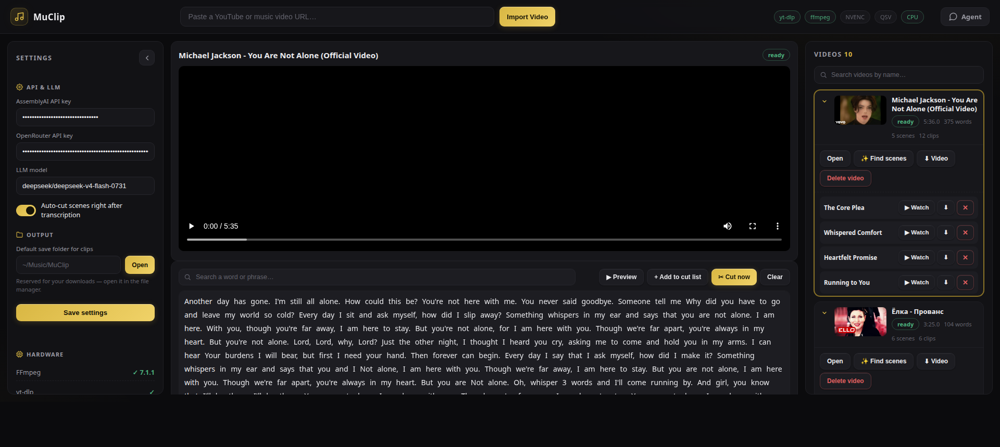
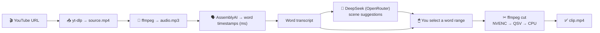

<div align="center">

# 🎬 MuClip

**Cut clips from music videos by *words* — not by timeframe.**

Paste a YouTube link → the video is transcribed with word-level timestamps →
pick a few words in the transcript → FFmpeg re-renders the exact clip.

> **По-русски:** [README.ru.md](README.ru.md)

[](https://www.python.org/)
[](https://fastapi.tiangolo.com/)
[](LICENSE)
[](https://docs.astral.sh/uv/)
[](https://ffmpeg.org/)

</div>

---

## ✨ What it does

- 🎥 Downloads any YouTube / music video (`yt-dlp`) and converts it to MP3 (`ffmpeg`)
- 🗣 Transcribes it with **AssemblyAI** — exact word-level timestamps in milliseconds
- 🤖 Optionally asks **DeepSeek** (via OpenRouter) to suggest the best cuttable moments
  — with reasoning tokens disabled, so it's fast and cheap
- ✂️ You **click on words** (or search a phrase) to define a clip, then cut it.
  Cuts are frame-accurate and use **NVENC → Intel QSV → CPU** encoding in that order
- 💬 Built-in chat agent: ask *“find the hook”* or *“where does he sing about the plane”*
  and get suggested moments as previewable, cuttable cards
- 🗂 Everything is persisted in a single `store.json` — no database required



---

## 🧠 How it works



Words become the *unit of editing*: a selection is cut **strictly on word
boundaries**, so the start/end syncs exactly with the speech. If the LLM
suggests scenes, its verbatim quote is mapped back onto word indices — anything
that can't be matched letter-for-letter inside the transcript is safely dropped.

---

## 📦 Requirements

| Dependency | Why |
|---|---|
| **Python 3.10+** with [`uv`](https://docs.astral.sh/uv/) | runtime & dependency manager |
| **FFmpeg** (`ffmpeg` on PATH) | audio extraction + clip rendering |
| **yt-dlp** (`yt-dlp` on PATH) | video download |
| **AssemblyAI API key** | speech-to-text with word timestamps |
| **OpenRouter API key** *(optional)* | LLM scene suggestions + chat agent |

> The app probes FFmpeg/yt-dlp and hardware encoders at startup and shows the
> results in the **Hardware** section of the settings panel.

---

## 🚀 Quick start

```bash
# 1. Get the code
git clone https://github.com/<you>/muclip.git
cd muclip

# 2. Install Python dependencies (uses uv + uv.lock)
uv sync

# 3. Make sure ffmpeg and yt-dlp are on PATH
#    Debian/Ubuntu:   sudo apt install ffmpeg yt-dlp
#    or pip:          uv tool install yt-dlp

# 4. Configure API keys — either via environment variables…
cp .env.example .env
# edit .env, then:
set -a; source .env; set +a

# 5. …or just launch and type the keys into the Settings panel (they are
#    stored in store.json, which is gitignored).
uv run server.py
```

Open **http://127.0.0.1:8010** and paste a music-video URL to start.

### Alternative run command

```bash
uv run uvicorn server:app --host 127.0.0.1 --port 8010
```

---

## ⚙️ Configuration

API keys and preferences can be set two ways:

1. **Settings panel** (left sidebar in the UI) — saved to `store.json`.
2. **Environment variables** — great for servers/CI, see [`.env.example`](.env.example).

| Variable | Purpose | Default |
|---|---|---|
| `MUCLIP_ASSEMBLY_KEY` | AssemblyAI API key | *(empty)* |
| `MUCLIP_OPENROUTER_KEY` | OpenRouter API key | *(empty)* |
| `MUCLIP_MODEL` | LLM model id (OpenRouter) | `deepseek/deepseek-v4-flash-0731` |
| `MUCLIP_HOST` | Bind address for `uv run server.py` | `127.0.0.1` |
| `MUCLIP_PORT` | Port for `uv run server.py` | `8010` |

---

## 🔌 HTTP API

The frontend is a single page, but everything is exportable over a small REST API:

| Method | Path | Purpose |
|---|---|---|
| `GET` | `/api/health` | liveness |
| `GET` | `/api/system` | ffmpeg/yt-dlp presence + active encoder |
| `GET` / `PUT` | `/api/settings` | read / write settings |
| `POST` | `/api/settings/open-folder` | open the download folder in the OS file manager |
| `POST` | `/api/videos` | `{url}` — start the import pipeline |
| `GET` | `/api/videos` | list videos (words, scenes, clips embedded) |
| `GET` | `/api/videos/{vid}` | one video |
| `DELETE` | `/api/videos/{vid}` | remove video + clips + files |
| `POST` | `/api/videos/{vid}/analyze` | run LLM scene search |
| `POST` | `/api/chat` | ask the agent a question about a video |
| `POST` | `/api/videos/{vid}/clips` | `{start_word, end_word, title}` → cut a clip |
| `POST` | `/api/videos/{vid}/scenes/{scene_id}/cut` | cut an LLM-suggested scene |
| `DELETE` | `/api/videos/{vid}/scenes/{scene_id}` | discard a suggestion |
| `GET` | `/api/clips` | all clips |
| `GET` | `/api/clips/{cid}/stream` \| `/download` | stream / save a clip |
| `POST` | `/api/clips/{cid}/title` | rename a clip |
| `POST` | `/api/clips/{cid}/range` | re-cut a clip with new word indices |
| `DELETE` | `/api/clips/{cid}` | delete clip + file |
| `GET` | `/api/videos/{vid}/stream` \| `/audio` \| `/download` | video / MP3 / full download (HTTP Range) |

---

## 📁 Project layout

```
.
├── server.py            FastAPI backend + full pipeline (single file)
├── static/
│   ├── index.html       UI markup
│   ├── style.css        dark "Voicebox" theme (gold accents)
│   └── app.js           frontend logic (vanilla JS, no build step)
├── store.json           all state: settings, videos, words, scenes, clips  (gitignored)
├── media/
│   ├── videos/<id>/     source.mp4, audio.mp3, thumb.jpg                    (gitignored)
│   └── clips/<id>.mp4   rendered clips                                      (gitignored)
├── docs/screenshot.png
├── .env.example
├── pyproject.toml
└── uv.lock
```

---

## 🛠 Tips & notes

- **All files are local.** `media/` and `store.json` are gitignored — no video
  data or API keys ever end up in the repository.
- Clips are **re-encoded** (not stream-copied) so the cut is frame-accurate to
  the millisecond word timestamps from AssemblyAI.
- If a hardware encoder fails at runtime (e.g. GPU is busy), the app silently
  retries on CPU.
- An LLM scene suggestion is skipped when its quote can't be matched verbatim
  in the transcript (punctuation/space-insensitive matching is applied).
- `language_detection` is enabled for AssemblyAI — works for any language.

---

## 📄 License

[MIT](LICENSE) © 2026 MuClip contributors